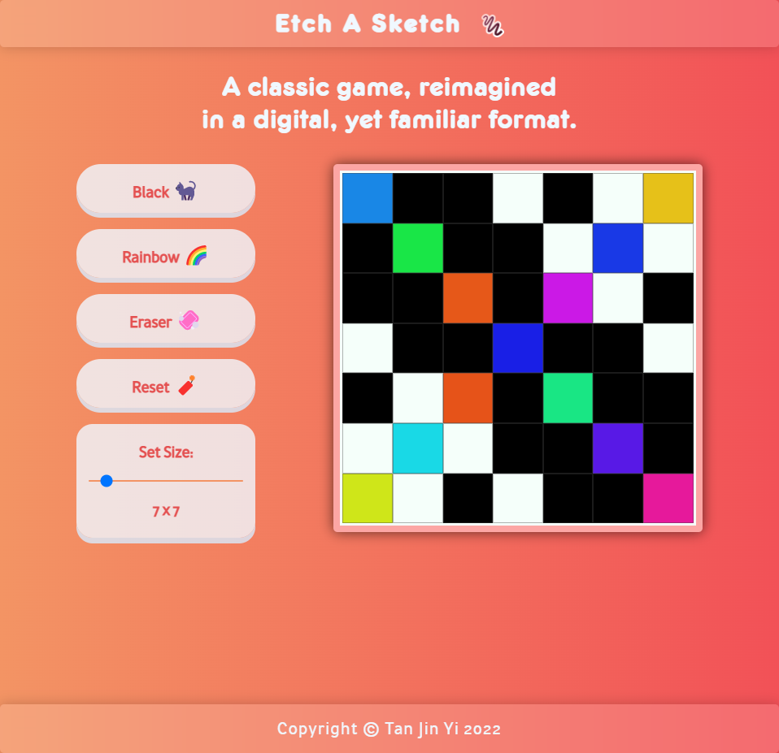

# Etch-A-Sketch

This is **Etch A Sketch**, reimagined in a digital, yet familiar format.

## Live Preview

This project is hosted on **GitHub Pages**. Feel free to [try it out](https://raineedust.github.io/etch-a-sketch/)!

## Motivation and Goals

This project is designed as part of **The Odin Project's** wonderful Web Development curriculum.

- [x] Explore mica effect
- [x] Implement pixel and button animations
- [x] Implement vibrant color scheme
- [x] Use slider over input number
- [x] Improve understanding of DOM
- [ ] Only initiate drawing when `onmousedown`

## Resources

Below are a collection of resources which helped improve my skills :sparkles: while building the project:

- [html - Creating a 16x16 grid using JavaScript - Stack Overflow](https://stackoverflow.com/questions/57550082/creating-a-16x16-grid-using-javascript)
- [CSS Grid Layout: The Fr Unit | DigitalOcean](https://www.digitalocean.com/community/tutorials/css-css-grid-layout-fr-unit)
- [CSS grid-template property](https://www.w3schools.com/cssref/pr_grid-template.asp)
- [Colors HSL](https://www.w3schools.com/colors/colors_hsl.asp)
- [html - Get the input value after pressing submit button in JavaScript - Stack Overflow](https://stackoverflow.com/questions/56923127/get-the-input-value-after-pressing-submit-button-in-javascript)
- [How to Center in CSS with CSS Grid](https://coryrylan.com/blog/how-to-center-in-css-with-css-grid)
- [HTML DOM Element removeChild Method](https://www.w3schools.com/jsref/met_node_removechild.asp)
- [HTML DOM Element firstChild Property](https://www.w3schools.com/jsref/prop_node_firstchild.asp)
- [HTML input max Attribute](https://www.w3schools.com/tags/att_input_max.asp)
- [How to Style Input Type Range in Chrome, Firefox, and IE | Brenna O'Brien](https://brennaobrien.com/blog/2014/05/style-input-type-range-in-every-browser.html)

Built with :heart: to **The Odin Project** ~
